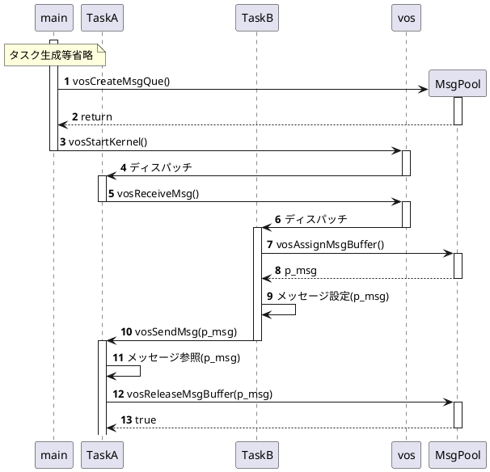

# マルチタスクOS(VOS) 設計書

---
## 目次
- [1.概要](#1概要)
  - [目的](#1-1目的)
- [2.システム構成](#2システム構成)
- [3.機能](#3機能)
  - [3-1.カーネル](#3-1カーネル)
  - [3-2.タスク機能](#3-2タスク機能)
  - [3-3.メッセージ機能](#3-3メッセージ機能)
  - [3-4.イベントフラグ機能](#3-4イベントフラグ機能)
  - [3-5.セマフォ機能](#3-5セマフォ機能)
- [4.機能API](#4機能-api)
- [5.VOS内部関数](#5vos内部関数)
- [Appendix](#appendix)

---
# 1.概要
## 1-1.目的
軽量リアルタイムOSを実装する。RTOS動作の仕組みやシステムのデバッグが安易なOSSとして展開する。

## 1-2.実装方針
- 一般的なRTOS同様、main関数にてアイドルタスク及びユーザタスクを繰り返し実行可能なループ実装にする。
- システムTICK割り込みを使用して、同一優先度のタスクのディスパッチを実装する。

## 1-3.用語説明
- タスク優先度
    最低優先度は 0:IDLEタスクで、順に1~7:ユーザタスクである。
- タスク状態
    以下のタスク状態がある。機能APIコールやディスパッチャによりタスクの状態が遷移する。
  - `未登録状態`:NON-EXIST
  - `休止状態`:DORMANT
  - `実行可能状態`:READY
  - `実行状態`:RUN
  - `待ち状態`:WAIT

## 1-4.基本定数・データ型
C言語ヘッダーファイルにて以下を定義する。但し、ヘッダーファイル構成は思案中。
vos_config.h：ユーザーが定義するVOSコンフィグレーション・ヘッダーファイル
```
/* VOSユーザーが決定する定数（リソース定数） */
#define VOS_TASK_NUM            (3)     /* ユーザータスク数 */
#define VOS_MSGQUE_NUM          (3)     /* メッセージキュー数 */
#define USER_QUE1_MSGBUFF_NUM   (2)     /* メッセージキュー１のメッセージバッファ数 */
#define USER_AUE2_MSGBUFF_NUM   (2)     /* メッセージキュー２のメッセージバッファ数 */
#define USER_QUE3_MSGBUFF_NUM   (2)     /* メッセージキュー３のメッセージバッファ数 */
#define VOS_TOTAL_MSG_NUM       (USER_QUE1_MSGBUFF_NUM
                                +USER_AUE2_MSGBUFF_NUM
                                +USER_QUE3_MSGBUFF_NUM)
/* VOSユーザーが決定するタスク優先度範囲 */
enum {
    TASK_PRI_LO = 1,                    /* 最低優先度 */
    TASK_PRI_MID = 4,
    TASK_PRI_HI = 7                     /* 最高優先度 */
}
/* VOS ユーザへ提供するデバッグ機能 */
#define VOS_STACK_OVF_CHECK     true    /* スタック・オバーフロー・チェック */
...

vos.h：VOSヘッダーファイル
/* VOS基本定数・データ型 */
#define VOS_END_PTR     (void*)(-1)     /* 端点(番人)ポインタ値 */
#define VOS_INIT_PTR    (NULL)          /* 初期ポインタ値 */
...

/* VOS APIのエラーリターンコード */
#define VOS_ERR_PARAM           (-1)    /* パラメータエラー */
#define VOS_ERR_RESOURCE        (-2)    /* リソース超過 */
...

/* VOS基本データ型(ビルド時の構造体前方宣言) */
typedef struct tag_vosMsgCB vosMsgCB_t;
typedef struct tag_vosEvtCB vosEvtCB_t;
typedef struct tag_vosSemCB vosSemCB_t;
typedef struct tag_vosTaskCB vosTaskCB_t;
typedef vosMsgCB_t* vosMsgHandle_t;     /* メッセージキューハンドル */
typedef vosEvtCB_t* vosEvtHandle_t;     /* イベントフラグハンドル */
typedef vosSemCB_t* vosSemHandle_t;     /* セマフォハンドル */
typedef vosTaskCB_t* vosTaskHandle_t;   /* タスクハンドル */
```

## 1-5.ユーザースタック領域
タスクのスタック領域構造
```
typedef struct {
#if(VOS_STACK_OVF_CHECK)
    uint32_t        safety[4];      /* スタックオーバー検知領域 */
#endif
    uint32_t        stack[1];       /* スタック領域 */
} VOS_STACK_t;
```

---
# 2.システム構成
```marmaidまたはplantumlによる作図
```

---
# 3.機能

## 3-1.カーネル
カーネル（Kernel）は、当マルチタスク・オペレーティングシステム（VOS）の中核となるソフトウェアである。
タスクのディスパッチや割り込みハンドラの実装を担当する。通常OSが管理するメモリ管理機能等々は各種機能にてユーザー提供する。

### 3-1-1.API設計
カーネルAPIの概要を以下に示す。
- カーネル初期化：vosInitKernel関数
    カーネル変数や各種機能変数を初期化する。
- カーネルスタート：vosStartKernel関数
    `実行可能状態`タスクを`実行状態`タスクへ遷移する。もし`実行可能状態`タスクがない場合、即リターンする。
- タスク・ディスパッチャー：vosDispatch関数
    詳細仕様未定
- コンテキストスイッチ：vosPendSVHandler 割り込みハンドラ
    タスク切り替え。
- システムタイマ：vosSysTickHandler 割り込みハンドラ
    仕様未定

### 3-1-2.データ設計
```
/* カーネルコントロールブロック */
typedef struct {
    bool            start_kernel;       /* カーネルStart/Stop */
    vosTaskQueHdr_t run_task;           /* RUNタスク */
    vosTaskQueHdr_t ready_que;          /* READYキュー */
    vosTaskQueHdr_t wait_que;           /* WAITキュー */
    vosTaskQueHdr_t stop_que;           /* STOPキュー */
} vosKernelCB_t;

/* カーネルコントロールブロック変数宣言 */
vosKernelCB_t       g_vosKernelCB;
```

**g_vosKernelCB変数更新表**
<table>
  <tr>
    <th>変数/メンバー変数</th>
    <th>更新関数</th>
    <th>説明</th>
  </tr>

  <tr>
    <td>g_vosKernelCB</td>
    <td>all-0: vosInitKernel()</td>
    <td>初期設定</td>
  </tr>

  <tr>
    <td>.start_kernel</td>
    <td>true: vosStartKernel()</td>
    <td>カーネルスタート後に設定</td>
  </tr>

  <tr>
    <td rowspan="3">.run_task</td>
    <td>vosTaskHandle_t 値: vosStartKernel()</td>
    <td>READYキューの先頭タスクを移動</td>
  </tr>
  <tr>
    <td>vosTaskHandle_t 値: vosExitTask()</td>
    <td>READYキューの先頭タスクを移動</td>
  </tr>
  </tr>
  <tr>
    <td>NULL: vosExitTask()</td>
    <td>READYキューが空（NUL/VOS_END_PTR）の場合</td>
  </tr>

  <tr>
    <td rowspan="4">.ready_que</td>
    <td>vosTaskHandle_t 値: vosStartTask()</td>
    <td>引数のタスクを繋げる</td>
  </tr>
  <tr>
    <td>vosTaskHandle_t 値: vosSendMsg()</td>
    <td>引数のメッセージをReceive待ちしているタスクを当該キューから移動</td>
  </tr>
  <tr>
    <td>vosTaskHandle_t 値: vosSetEvtFlg()</td>
    <td>引数のイベントフラグをWait待ちしているタスクを当該キューから移動</td>
  </tr>
  <tr>
    <td>vosTaskHandle_t 値: vosGiveSem()</td>
    <td>引数のセマフォをTake待ちしているタスクを当該キューから移動</td>
  </tr>

  <tr>
    <td rowspan="3">.wait_que</td>
    <td>vosTaskHandle_t 値: vosReceiveMsg()</td>
    <td rowspan="3">RUNタスクから移動</td>
  </tr>
  <tr>
    <td>vosTaskHandle_t 値: vosWaitEvt()</td>
  </tr>
  <tr>
    <td>vosTaskHandle_t 値: vosTakeSem()</td>
  </tr>

  <tr>
    <td>.stop_que</td>
    <td>vosTaskHandle_t 値: vosStopTask()</td>
    <td>引数のタスクを当該キューから移動</td>
  </tr>

  <tr>
    <td></td>
    <td></td>
    <td></td>
  </tr>
</table>


---
## 3-2.タスク機能
タスク機能は、タスクの生成・スタート・ストップ・終了のアクション系APIと、タスク状態を参照するリファレンス系APIをユーザーに提供する。
タスクは、タスク優先度を持ち優先順にタスクを動作させる。同一優先度の場合は、FIFO動作させる。

タスク機能がタスクコントロールブロックを管理し、カーネルがタスク状態キューを管理する。
タスク状態は、READYキュー、WAITキューを実装し、RUN状態はTCBポインタのみ、DORMANTはキュー無し実装である。

### 3-2-1.API設計
タスク機能APIの概要を以下に示す。
- タスク生成：vosCreateTask関数
    引数は、タスク関数、スタックサイズ、スタック領域（、スタート指示）である。
    タスクコントロールブロックを獲得して情報をセットする。獲得したTCBをタスクハンドルとして返す。
- タスクスタート：vosStartTask関数
    引数は、タスクハンドルである。
    タスクハンドルのTCBをREADYキューに繋げる。
- タスクストップ：vosStopTask関数
    引数は、タスクハンドルである。
    タスクハンドルのTCBをキューから外す。
- タスク終了：vosExitTask関数
    引数なし。自タスクを終了する。
    自タスクのタスクコントロールブロックを解放する。

### 3-2-2.データ設計
```
/* タスクコントロールブロック */
struct tag_vosTaskCB {
    vosTaskCB_t*    next_ptr;           /* タスクコントロールブロック・リストポインタ */
    union {
        vosMsgCB_t* msg_cb;             /* メッセージキュー */
        vosEvtCB_t* evt_cb;             /* イベントフラグ */
        vosSemCB_t* sem_cd;             /* セマフォ */
    }wait_svc;                          /* 受信待ちサービス */
    uint32_t        task_pri;           /* タスク優先度 */
    uint32_t        stack_size;         /* スタック領域サイズ(単位:32bit) */
    uint32_t*       stacK_top;          /* スタック領域先頭アドレス */
    uint32_t*       task_func;          /* タスク実行アドレス */
};

/* タスク状態キュー */
typedef struct {
    vosTaskCB_t *   next_ptr;    
} vosTaskQueHdr_t;

/* 各種コントロールブロック変数宣言 */
vosTaskCB_t         g_vosTaskCB[VOS_TASK_NUM];
```


### 3-2-3.APIコーリングシーケンス例
タスク機能APIのコーリングシーケンス例を以下に示す。


---
## 3-3.メッセージ機能
メッセージ機能は、タスク間のメッセージ送受信に用いる機能である。
まず、メッセージを送受信するためのメッセージキュー(メッセージプール)を生成する必要がある。
メッセージキューは、メッセージのデータサイズとデータ個数とデータバッファ領域を用意して生成する（データバッファ領域＝データサイズ×データ個数）。
メッセージキューには、固定長メッセージデータプール機能を内包しており、メッセージ送受信時のデータコピーを無くすことも可能なインタフェース（vosAssignMsgBuffer関数、vosReleaseMsgBuffer関数）を備えている。メッセージ送信側タスクと受信側タスク間でメッセージバッファの整合（Assign/Release）が必要がないインタフェースも備えている。どちらを選択するかはvosコンフィグレーションファイル(vos_config.h)で指定する。

### 3-3-1.API設計
メッセージ機能APIの概要を以下に示す。
- メッセージキュー生成：vosCreateMsgQue関数
    引数は、メッセージキュー数、メッセージデータサイズ、メッセージデータ領域（メッセージプール領域）である。
    メッセージコントロールブロック(MsgCB)を獲得して情報をセットする。獲得したMsgCBをメッセージキューハンドルとして返す。
- メッセージ送信：vosSendMsg関数
    引数は、メッセージキューハンドル、ユーザーが用意したメッセージデータまたはvosAssignMsgBuffer関数で得たメッセージバッファである。
    ユーザーが用意したメッセージデータが渡された場合、メッセージプール領域にメッセージデータがコピーされ保持される。
- メッセージ受信：vosReceiveMsg関数
    引数は、メッセージキューハンドルである。受信したメッセージデータのポインタを返す。
    受信したメッセージデータは、vosReleaseMsgBuffer関数がコールされるまでメッセージプール領域に保持される（データ保証する）。
- メッセージバッファ獲得：vosAssignMsgBuffer関数
    引数は、メッセージキューハンドルである。獲得したメッセージバッファを返す。
    ユーザーは、返されたメッセージバッファにデータをセットしてメッセージ送信する。
- メッセージバッファ解放：vosReleaseMsgBuffer関数
    引数は、メッセージキューハンドル、vosAssignMsgBuffer関数で得て解放するメッセージバッファである。

### 3-3-2.データ設計
```
/* メッセージコントロールブロック */
typedef struct tag_vosMsgHdr vosMsgHdr_t;
struct tag_vosMsgHdr {
    vosMsgHdr_t *   next_ptr;           /* 送受信メッセージチェイン */
    uint32_t *      msg_ptr;            /* メッセージバッファ・ポインタ(生成時にセットアップ) */
};

typedef struct {
    vosTaskQueHdr_t wait_task;          /* 受信待ちタスクコントロールブロック・ポインタ */
    /* メッセージプール */
    uint32_t        msg_num;            /* メッセージバッファ数 */
    uint32_t        msg_size;           /* メッセージバッファ１つのサイズ */
    uint32_t *      msg_pool;           /* メッセージバッファ領域 */
    vosMsgHdr_t *   msg_buff;           /* メッセージバッファ先頭ポインタ */
    uint32_t        free_idx;           /* メッセージバッファ空きインデックス[0~msg_num-1] */
    vosMsgHdr_t     msg_que;            /* 送受信メッセージキュー */
} vosMsgCB_t;

/* 各種コントロールブロック変数宣言 */
vosMsgHdr_t         g_vosMsgBuff_t[VOS_TOTAL_MSG_NUM]
vosMsgCB_t          g_vosMsgCB[VOS_MSGQUE_NUM];
```

### 3-3-3.APIコーリングシーケンス例
メッセージデータコピー無しのメッセージ機能APIのコーリングシーケンス例を下図に示す。


**機能補足**
VOSでは可変長メッセージ機能は実装しない。可変長データはユーザーがリングバッファを用意してリードポインタとライトポインタでバッファリングする方法がリーズナブルでかつベスト選択だと思われるからである。

---
# 以下、仕様未確定、設計未確定 事項
---

---
## 3-4.イベントフラグ機能
イベントフラグ機能は、タスク間で32ビットデータを送受信する機能である。32ビットのビットフィールドは、ユーザータスク間にて自由に取り決め、32bitのいずれかのビットが'1'の場合、`イベントフラグ待ち`状態を解除する。`イベントフラグ待ち`APIをコールしたとき、すでにビットが'1'の場合、待ち状態に入らず直ぐにリターンする。VOSはビットフィールドをセット／クリアする操作APIを提供する。
複数タスクが１つのイベントフラグに対して`イベントフラグ待ち`を実施できない。
システム全体のイベントフラグ数は、VOSコンフィグレーションファイル`vos_config.h`に定義すること。

### 3-4-1.API設計
イベントフラグ機能APIの概要を以下に示す。
- イベントフラグ生成：vosCreateEvtFlg関数
    引数は、イベントフラグ領域（イベントフラグ領域）は任意で指定する事により領域をユーザー空間に定義可能である。
    生成成功した場合、イベントフラグハンドルを返す。
- イベントフラグ待ち：vosWaitEvtFlg関数
    引数は、イベントフラグハンドル、イベントフラグを受け取る変数アドレスを指定する。
    当APIは、該当するイベントフラグコントロールブロックのevt_flgがall-0の場合、wait_taskに自タスクハンドルをセットして、WAITキューに当該タスクコントロールブロックを繋ぎ、他タスクにデスパッチする。
    イベントフラグを受信した場合、引数で指定したイベントフラグ変数に値がセットされる。
- イベントフラグ・セット：vosSetEvtFlg関数
    引数は、イベントフラグハンドル、送信するイベントフラグを指定する。
    イベントフラグ待ちしているタスク（WAITキューを走査してタスクハンドルが一致したタスク）が高優先の場合、そのタスクにディスパッチする。優先度が同一以下の場合、当該タスクをREADYキューに繋ぎ、当APIはリターンする。
- イベントフラグ・クリア：vosClearEvtFlg関数
    引数は、イベントフラグハンドル、クリアするビットを立てたイベントフラグを指定する。
    他タスクにディスパッチしないAPIである。

### 3-4-2.データ設計
```
/* イベントフラグコントロールブロック */
struct tag_vosEvtCB {
    uint32_t        evt_flg;            /* イベントフラグ */
    vosTaskQueHdr_t wait_task;          /* 待ち状態タスクコントロールブロック・ポインタ */
};
```

---
## 3-5.セマフォ機能
セマフォ機能は、資源に対応したカウンタ(値)をVOS内で持ちユーザが資源管理することが可能である。
セマフォ生成時にカウンタ初期値を指定してセマフォハンドルを生成し、セマフォ獲得時にカウンタが１以上であれば、カウンタを１減算してAPIはリターンする。カウンタが０以下の場合、自タスクは、待ち行列に繋がれ、他タスクにディスパッチされる。

### 3-5-1.API設計
セマフォ機能APIの概要を以下に示す。
- セマフォ生成：vosCreateSem関数
    引数は、セマフォカウンタ初期値を指定する。
    生成成功した場合、セマフォハンドルを返す。
- セマフォ獲得：vosTakeSem関数
    引数は、セマフォハンドルを指定する。
    セマフォカウンタから１減算する。その結果０未満の場合、自タスクは待ち行列(WAITキュー)に繋がれ、他タスクにディスパッチする。カウンタが０以上の場合、当APIはリターンする。
- セマフォ返却：vosGiveSem関数
    引数は、セマフォハンドルを指定する。
    セマフォカウンタがセマフォカウンタ初期値以上の場合、エラーリターンする。
    セマフォカウンタに１加算する。その結果１の場合、待ち行列(WAITキュー)に繋がれている当該タスクが自タスクより優先度が高ければ、そのタスクにディスパッチする。優先度が同一以下の場合、当該タスクをREADYキューに繋ぎ、当APIはリターンする。

### 3-5-2.データ設計
```
/* セマフォコントロールブロック */
struct tag_vosSemCB {
    int32_t         sem_cnt;            /* セマフォカウンタ */
    int32_t         init_cnt;           /* セマフォカウンタ初期値 */
    vosTaskQueHdr_t wait_task;          /* 待ち状態タスクコントロールブロック・ポインタ */
};
```


---
# 4.機能 API
## 4-1.タスクの生成
**プロトタイプ**
```
vosTaskHandle_t  vosCreateTask(int32_t (*task)(int32_t, char**), uint32_t pri, uint32_t stack_size, uint32_t *stack);
```

**パラメータ**
    [in] task(int32_t argc, char **argv):タスクの関数アドレス
    [in] pri:タスクの優先度
    [in] stack_size:タスクのスタックサイズ
    [in] stack:タスクのスタック領域
**リターン**
    0以外:生成成功。生成したタスクハンドルを返す。
    0:失敗。失敗要因は getError()で取得する。[エラー一覧](#6-1エラー一覧)参照。
**機能説明**
    タスクの状態が`未登録状態`から`休止状態`に遷移する。
**補足説明**
    実装としては、タスクはタスクコントロールブロック(TCB)に割り当てられる。

## 4-2.タスクスタート
**プロトタイプ**
```
bool vosStartTask(vodTaskHandle_t handle);
```
**パラメータ**
    [in] handle: スタートするタスクハンドル
**リターン**
    true    成功
    false   失敗（パラメータエラー）
**機能説明**
    タスクの状態が`休止状態`から`実行可能状態`に遷移する。もしvosStartKernel実行中でかつ実行中のタスクより高優先度の場合、当該タスクにディスパッチする。
**補足説明**
    タスクハンドルのTCBをREADYキューに繋げ、カーネルがスタート状態ならRUNタスク優先度と比較し、自タスクが高優先の場合、ディスパッチャーをコールする。

## 4-3.タスクストップ
**プロトタイプ**
bool vosStopTask(vodTaskHandle_t handle);
**パラメータ**
　   [in] handle: ストップするタスクハンドル
**リターン**
    true    成功
    false   失敗（パラメータエラー）
**機能説明**
    当該タスクの状態が`休止状態`に遷移する。当該タスクが`実行状態`の場合、ディスパッチが発生する。
**補足説明**
    タスクハンドルのタスクコントロールブロックをキューから外す。当該タスクがRUNタスクの場合、ディスパッチャーをコールする。

## 4-4.タスク終了
**プロトタイプ**
```
void vosExitTask(void);
```
**パラメータ**
    なし。
**リターン**
    なし。
**機能説明**
    自タスクを終了する。全てのタスクが終了した場合、vosStartKernel()がリターンする。
**補足説明**
    自タスクのタスクコントロールブロックを初期化する。全てのタスクが終了した場合、vosStartKernel()からリターンする。


---
# 5.VOS内部関数

---
## 5-1.タスクキュー操作
### 5-1-1.タスクキュー・エンキュー
タスク優先度順の線形リストに対象を繋ぐ。キューの終端は、VOS_END_PTRをセットする。
void vosTaskEnque(vosTaskQueHdr_t * hdr_ptr, vosTaskCB_t * task_ptr);
### 5-1-2.タスクキュー・デキュー
タスク優先度順の線形リストの先頭データを外す。キューの終端は、VOS_END_PTRである。
vosTaskCB_t * vosTaskDeque(vosTaskQueHdr_t * hdr_ptr);
### 5-1-3.対象タスク・デキュー
タスクキューから対象データを外す。キューの終端は、VOS_END_PTRである。
bool vosTargetTaskDeque(vosTaskQueHdr_t * hdr_ptr, vosTaskCB_t * task_ptr);

---
## 5-2.メッセージキュー操作
### 5-2-1.メッセージキュー・エンキュー
void vosMsgEnque(vosMsgHdr_t * hdr_ptr, vosMsgCB_t * msg_ptr);
### 5-2-2.メッセージキュー・デキュー
vosMsgCB_t * vosMsgDeque(vosMsgHdr_t * hdr_ptr);

---
## 5-3.メモリ操作
### 5-3-1.32bitメモリフィル
voud vosMemset(uint32_t * des, uint32_t fill, uint32_t byte_sz);
### 5-3-2.32bitメモリコピー
voud vosMemcpy(uint32_t * des, uint32_t * src, uint32_t byte_sz);


---
# Appendix
## PendSV例外を使用するディスパッチャ―
vosPendSVHandler 割り込みハンドラ
- 1.vosDispatch() がコールされると、CPUに「PendSV例外発行」を依頼する。
- 2.他の優先度の高い割り込み（タイマーなど）がなければ、即座に PendSV_Handler が起動します。
- 3.ハンドラ起動時、Cortex-M仕様により、自動的にその時点のCPUレジスタである R0-R3, R12, LR, PC, xPSR がスタック（PSP）に自動保存されます。
- 4.アセンブリ内で、残り半分の R4-R11 を手動で同じスタックに保存します。
- 5.動かしたいタスクのスタックから逆の手順でレジスタを復元し、bx lr で元のタスク空間へジャンプします。

## SysTickタイマー割り込みを使用するVOS TICk
vosSysTickHandler 割り込みハンドラ
- SysTickを用いて一定時間ごとにタスクを切り替える（ラウンドロビン・タイムスライス）ための仕組みの追加
