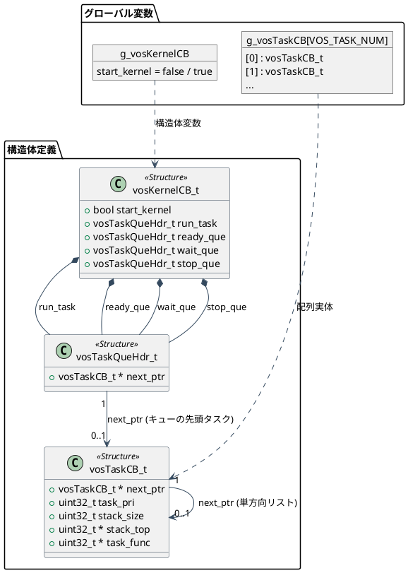
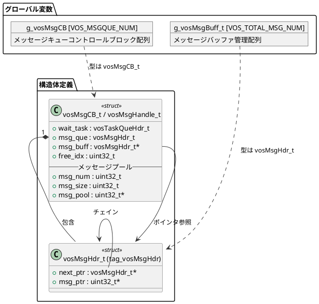
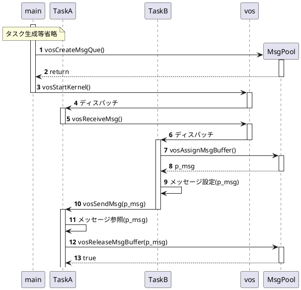

# マルチタスクOS(VOS) 設計書

---
## 目次
- [1.概要](#1概要)
  - [目的](#1-1目的)
- [2.システム構成](#2システム構成)
- [3.機能](#3機能)
  - [3-1.タスク機能](#3-1タスク機能)
  - [3-2.メッセージ機能](#3-2メッセージ機能)
  - [3-3.イベントフラグ機能](#3-3イベントフラグ機能)
  - [3-4.セマフォ機能](#3-4セマフォ機能)
- [4.機能API](#4機能-api)
- [5.VOS内部関数](#5vos内部関数)
- [Appendix](#appendix)

---
# 1.概要
## 1-1.目的
軽量リアルタイムOSを実装する。RTOS動作の仕組みやシステムのデバッグが安易なOSSとして展開する。

## 1-2.実装方針
- 一般的なRTOS同様、main関数にてアイドルタスク及びユーザタスクを繰り返し実行可能なループ実装にする。
- システムTICK割り込みを使用して、同一優先度のタスクのディスパッチを実装する。

## 1-3.用語説明
- タスク優先度
    最低優先度は 0:IDLEタスクで、順に1~7:ユーザタスクである。
- タスク状態
    以下のタスク状態がある。機能APIコールやディスパッチャによりタスクの状態が遷移する。
  - `未登録状態`:NON-EXIST
  - `休止状態`:DORMANT
  - `実行可能状態`:READY
  - `実行状態`:RUN
  - `待ち状態`:WAIT

## 1-4.基本定数・データ型
C言語ヘッダーファイルにて以下を定義する。但し、ヘッダーファイル構成は思案中。
vos_config.h：ユーザーが定義するVOSコンフィグレーション・ヘッダーファイル
```
/* VOSユーザーが決定する定数（リソース定数） */
#define VOS_TASK_NUM            (3)     /* ユーザータスク数 */
#define VOS_MSGQUE_NUM          (3)     /* メッセージキュー数 */
#define USER_QUE1_MSGBUFF_NUM   (2)     /* メッセージキュー１のメッセージバッファ数 */
#define USER_AUE2_MSGBUFF_NUM   (2)     /* メッセージキュー２のメッセージバッファ数 */
#define USER_QUE3_MSGBUFF_NUM   (2)     /* メッセージキュー３のメッセージバッファ数 */
#define VOS_TOTAL_MSG_NUM       (USER_QUE1_MSGBUFF_NUM
                                +USER_AUE2_MSGBUFF_NUM
                                +USER_QUE3_MSGBUFF_NUM)
/* VOSユーザーが決定するタスク優先度範囲 */
enum {
    TASK_PRI_LO = 1,                    /* 最低優先度 */
    TASK_PRI_MID = 4,
    TASK_PRI_HI = 7                     /* 最高優先度 */
}
/* VOS ユーザへ提供するデバッグ機能 */
#define VOS_STACK_OVF_CHECK     true    /* スタック・オバーフロー・チェック */
...

vos.h：VOSヘッダーファイル
/* VOS基本定数・データ型 */
#define VOS_END_PTR     (void*)(-1)     /* 端点(番人)ポインタ値 */
#define VOS_INIT_PTR    (NULL)          /* 初期ポインタ値 */
...

/* VOS APIのエラーリターンコード */
#define VOS_ERR_PARAM           (-1)    /* パラメータエラー */
#define VOS_ERR_RESOURCE        (-2)    /* リソース超過 */
...

/* VOS基本データ型(ビルド時の構造体前方宣言) */
typedef struct tag_vosMsgCB vosMsgCB_t;
typedef struct tag_vosEvtCB vosEvtCB_t;
typedef struct tag_vosSemCB vosSemCB_t;
typedef struct tag_vosTaskCB vosTaskCB_t;
typedef vosMsgCB_t* vosMsgHandle_t;     /* メッセージキューハンドル */
typedef vosEvtCB_t* vosEvtHandle_t;     /* イベントフラグハンドル */
typedef vosSemCB_t* vosSemHandle_t;     /* セマフォハンドル */
typedef vosTaskCB_t* vosTaskHandle_t;   /* タスクハンドル */
```

## 1-5.ユーザースタック領域
タスクのスタック領域構造
```
typedef struct {
#if(VOS_STACK_OVF_CHECK)
    uint32_t        safety[4];      /* スタックオーバー検知領域 */
#endif
    uint32_t        stack[1];       /* スタック領域 */
} VOS_STACK_t;
```

---
# 2.システム構成
```marmaidまたはplantumlによる作図
```

---
# 3.機能

---
## 3-1.タスク機能
タスク機能は、タスクの生成・スタート・ストップ・終了のアクション系APIと、タスク状態を参照するリファレンス系APIをユーザーに提供する。
タスクは、タスク優先度を持ち優先順にタスクを動作させる。同一優先度の場合は、FIFO動作させる。

タスク機能がタスクコントロールブロックを管理し、カーネルがタスク状態キューを管理する。
タスク状態は、READYキュー、WAITキューを実装し、RUN状態はTCBポインタのみ、DORMANTはキュー無し実装である。

### 3-1-1.API設計
タスク機能APIの概要を以下に示す。
- タスク生成：vosCreateTask関数
    引数は、タスク関数、スタックサイズ、スタック領域（、スタート指示）である。
    タスクコントロールブロックを獲得して情報をセットする。獲得したTCBをタスクハンドルとして返す。
- タスクスタート：vosStartTask関数
    引数は、タスクハンドルである。
    タスクハンドルのTCBをREADYキューに繋げる。
- タスクストップ：vosStopTask関数
    引数は、タスクハンドルである。
    タスクハンドルのTCBをキューから外す。
- タスク終了：vosExitTask関数
    引数なし。自タスクを終了する。
    自タスクのタスクコントロールブロックを解放する。

### 3-1-2.データ設計
```
/* タスクコントロールブロック */
struct tag_vosTaskCB {
    vosTaskCB_t *   next_ptr;           /* タスクコントロールブロック・リストポインタ */
    union {
        vosMsgCB_t * msg_cb;            /* メッセージキュー */
        vosEvtCB_t * evt_cb;            /* イベントフラグ */
        vosSemCB_t * sem_cd;            /* セマフォ */
    }wait_svc;                          /* 受信待ちサービス */
    uint32_t        task_pri;           /* タスク優先度 */
    uint32_t        stack_size;         /* スタック領域サイズ(単位:32bit) */
    uint32_t *      stacK_top;          /* スタック領域先頭アドレス */
    uint32_t *      task_func;          /* タスク実行アドレス */
};

/* タスク状態キュー */
typedef struct {
    vosTaskCB_t *   next_ptr;    
} vosTaskQueHdr_t;

/* カーネルコントロールブロック */
typedef struct {
    bool            start_kernel;       /* カーネルStart/Stop */
    vosTaskQueHdr_t run_task;           /* RUNタスク */
    vosTaskQueHdr_t ready_que;          /* READYキュー */
    vosTaskQueHdr_t wait_que;           /* WAITキュー */
    vosTaskQueHdr_t stop_que;           /* STOPキュー */
} vosKernelCB_t;

/* 各種コントロールブロック変数宣言 */
vosTaskCB_t         g_vosTaskCB[VOS_TASK_NUM];
vosKernelCB_t       g_vosKernelCB;
```



### 3-1-3.APIコーリングシーケンス例
タスク機能APIのコーリングシーケンス例を以下に示す。


---
## 3-2.メッセージ機能
メッセージ機能は、タスク間のメッセージ送受信に用いる機能である。
まず、メッセージを送受信するためのメッセージキュー(メッセージプール)を生成する必要がある。
メッセージキューは、メッセージのデータサイズとデータ個数とデータバッファ領域を用意して生成する（データバッファ領域＝データサイズ×データ個数）。
メッセージキューには、固定長メッセージデータプール機能を内包しており、メッセージ送受信時のデータコピーを無くすことも可能なインタフェース（vosAssignMsgBuffer関数、vosReleaseMsgBuffer関数）を備えている。メッセージ送信側タスクと受信側タスク間でメッセージバッファの整合（Assign/Release）が必要がないインタフェースも備えている。どちらを選択するかはvosコンフィグレーションファイル(vos_config.h)で指定する。

### 3-2-1.API設計
メッセージ機能APIの概要を以下に示す。
- メッセージキュー生成：vosCreateMsgQue関数
    引数は、メッセージキュー数、メッセージデータサイズ、メッセージデータ領域（メッセージプール領域）である。
    メッセージコントロールブロック(MsgCB)を獲得して情報をセットする。獲得したMsgCBをメッセージキューハンドルとして返す。
- メッセージ送信：vosSendMsg関数
    引数は、メッセージキューハンドル、ユーザーが用意したメッセージデータまたはvosAssignMsgBuffer関数で得たメッセージバッファである。
    ユーザーが用意したメッセージデータが渡された場合、メッセージプール領域にメッセージデータがコピーされ保持される。
- メッセージ受信：vosReceiveMsg関数
    引数は、メッセージキューハンドルである。受信したメッセージデータのポインタを返す。
    受信したメッセージデータは、vosReleaseMsgBuffer関数がコールされるまでメッセージプール領域に保持される（データ保証する）。
- メッセージバッファ獲得：vosAssignMsgBuffer関数
    引数は、メッセージキューハンドルである。獲得したメッセージバッファを返す。
    ユーザーは、返されたメッセージバッファにデータをセットしてメッセージ送信する。
- メッセージバッファ解放：vosReleaseMsgBuffer関数
    引数は、メッセージキューハンドル、vosAssignMsgBuffer関数で得て解放するメッセージバッファである。

### 3-2-2.データ設計
```
/* メッセージコントロールブロック */
typedef struct tag_vosMsgHdr vosMsgHdr_t;
struct tag_vosMsgHdr {
    vosMsgHdr_t *   next_ptr;           /* 送受信メッセージチェイン */
    uint32_t *      msg_ptr;            /* メッセージバッファ・ポインタ(生成時にセットアップ) */
};

typedef struct {
    vosTaskQueHdr_t wait_task;          /* 受信待ちタスクコントロールブロック・ポインタ */
    /* メッセージプール */
    uint32_t        msg_num;            /* メッセージバッファ数 */
    uint32_t        msg_size;           /* メッセージバッファ１つのサイズ */
    uint32_t *      msg_pool;           /* メッセージバッファ領域 */
    vosMsgHdr_t *   msg_buff;           /* メッセージバッファ先頭ポインタ */
    uint32_t        free_idx;           /* メッセージバッファ空きインデックス[0~msg_num-1] */
    vosMsgHdr_t     msg_que;            /* 送受信メッセージキュー */
} vosMsgCB_t;

/* 各種コントロールブロック変数宣言 */
vosMsgHdr_t         g_vosMsgBuff_t[VOS_TOTAL_MSG_NUM]
vosMsgCB_t          g_vosMsgCB[VOS_MSGQUE_NUM];
```


### 3-2-3.APIコーリングシーケンス例
メッセージデータコピー無しのメッセージ機能APIのコーリングシーケンス例を下図に示す。


**機能補足**
VOSでは可変長メッセージ機能は実装しない。可変長データはユーザーがリングバッファを用意してリードポインタとライトポインタでバッファリングする方法がリーズナブルでかつベスト選択だと思われるからである。

---
# 以下、仕様未確定、設計未確定 事項
---

---
## 3-3.イベントフラグ機能
仕様未確定
### 3-3-1.API設計
未確定
### 3-3-2.データ設計
未確定
```
/* イベントフラグコントロールブロック */
struct tag_vosEvtCB {
    uint32_t        evt_flg;            /* イベントフラグ */
};
```

---
## 3-4.セマフォ機能
仕様未確定
### 3-4-1.API設計
未確定
### 3-4-2.データ設計
未確定
```
/* セマフォコントロールブロック */
struct tag_vosSemCB {
    int32_t         sem_cnt;            /* セマフォカウンタ */
};
```

---
## 3-5.タスク・ディスパッチ機能
vosDispatch()
vosPendSVHandler 割り込みハンドラ
仕様未確定

---
## 3-6.VOS Tick機能
vosSysTickHandler 割り込みハンドラ
仕様未確定


---
# 4.機能 API
## 4-1.タスクの生成
**プロトタイプ**
```
vosTaskHandle_t  vosCreateTask(int32_t (*task)(int32_t, char**), uint32_t pri, uint32_t stack_size, uint32_t *stack);
```

**パラメータ**
```
[in] task(int32_t argc, char **argv):タスクの関数アドレス
[in] pri:タスクの優先度
[in] stack_size:タスクのスタックサイズ
[in] stack:タスクのスタック領域
```

**リターン**
0以外:生成成功。生成したタスクハンドルを返す。
0:失敗。失敗要因は getError()で取得する。[エラー一覧](#6-1エラー一覧)参照。

**機能説明**
タスクの状態が`未登録状態`から`休止状態`あるいは`実行可能状態`に遷移する。vosStartKernel()が実行されてない状態では、タスクは`未登録状態`から`休止状態`に遷移するだけですが、vosStartKernel()実行後は`休止状態`から`実行可能状態`に自動遷移する。

**補足説明**
実装としては、タスクはタスクコントロールブロック(TCB)に割り当てられ、READYキューに優先度順に並べられる。
カーネルがstartしている場合、ディスパッチャーによりタスクのディスパッチが発生する可能性がある。


---
# 5.VOS内部関数

---
## 5-1.タスクキュー操作
### 5-1-1.タスクキュー・エンキュー
タスク優先度順の線形リストに対象を繋ぐ。キューの終端は、VOS_END_PTRをセットする。
void vosTaskEnque(vosTaskQueHdr_t * hdr_ptr, vosTaskCB_t * task_ptr);
### 5-1-2.タスクキュー・デキュー
タスク優先度順の線形リストの先頭データを外す。キューの終端は、VOS_END_PTRである。
vosTaskCB_t * vosTaskDeque(vosTaskQueHdr_t * hdr_ptr);
### 5-1-3.対象タスク・デキュー
タスクキューから対象データを外す。キューの終端は、VOS_END_PTRである。
bool vosTargetTaskDeque(vosTaskQueHdr_t * hdr_ptr, vosTaskCB_t * task_ptr);

---
## 5-2.メッセージキュー操作
### 5-2-1.メッセージキュー・エンキュー
void vosMsgEnque(vosMsgHdr_t * hdr_ptr, vosMsgCB_t * msg_ptr);
### 5-2-2.メッセージキュー・デキュー
vosMsgCB_t * vosMsgDeque(vosMsgHdr_t * hdr_ptr);

---
## 5-3.メモリ操作
### 5-3-1.32bitメモリフィル
voud vosMemset(uint32_t * des, uint32_t fill, uint32_t byte_sz);
### 5-3-2.32bitメモリコピー
voud vosMemcpy(uint32_t * des, uint32_t * src, uint32_t byte_sz);


---
# Appendix
## PendSV例外を使用するディスパッチャ―
vosPendSVHandler 割り込みハンドラ
- 1.vosDispatch() がコールされると、CPUに「PendSV例外発行」を依頼する。
- 2.他の優先度の高い割り込み（タイマーなど）がなければ、即座に PendSV_Handler が起動します。
- 3.ハンドラ起動時、Cortex-M仕様により、自動的にその時点のCPUレジスタである R0-R3, R12, LR, PC, xPSR がスタック（PSP）に自動保存されます。
- 4.アセンブリ内で、残り半分の R4-R11 を手動で同じスタックに保存します。
- 5.動かしたいタスクのスタックから逆の手順でレジスタを復元し、bx lr で元のタスク空間へジャンプします。

## SysTickタイマー割り込みを使用するVOS TICk
vosSysTickHandler 割り込みハンドラ
- SysTickを用いて一定時間ごとにタスクを切り替える（ラウンドロビン・タイムスライス）ための仕組みの追加
