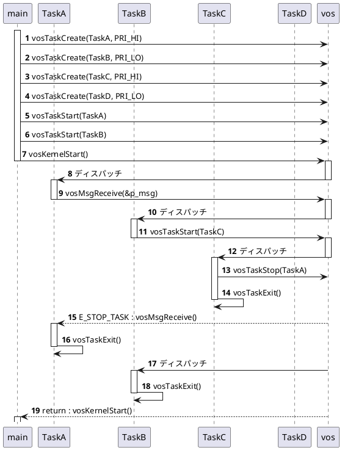
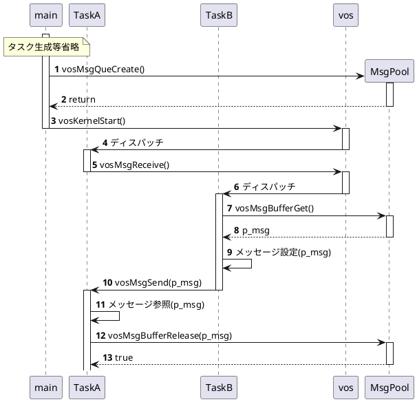

# マルチタスクOS(VOS) 設計書
    初版 26/06/01
---
## 目次
- [1.概要](#1概要)
  - [1-1.目的](#1-1目的)
  - [1-2.実装方針](#1-2実装方針)
  - [1-3.用語説明](#1-3用語説明)
  - [1-4.基本定数・データ型](#1-5ユーザースタック領域)
  - [1-5.ユーザースタック領域](#1-5ユーザースタック領域)
- [2.システム構成](#2システム構成)
- [3.機能](#3機能)
  - [3-1.カーネル](#3-1カーネル)
  - [3-2.タスク機能](#3-2タスク機能)
  - [3-3.メッセージ機能](#3-3メッセージ機能)
  - [3-4.イベントフラグ機能](#3-4イベントフラグ機能)
  - [3-5.セマフォ機能](#3-5セマフォ機能)
  - [3-6.割り込み制御機能](#3-6割り込み制御機能)
- [4.機能API](#4機能-api)
- [5.VOS内部関数](#5vos内部関数)
- [6.エラーコード](#6エラーコード)
- [Appendix](#appendix)

---
# 1.概要
## 1-1.目的
軽量リアルタイムOSを実装する。RTOS動作の仕組みやシステムのデバッグが安易なOSSとして展開する。

## 1-2.実装方針
- 一般的なRTOS同様、main関数にてアイドルタスク及びユーザタスクを繰り返し実行可能なループ実装にする。
- システムTICK割り込みを使用して、同一優先度のタスク・ディスパッチを実装する。
- タスク・ディスパッチは、レジスタ退避・復元が必要となるので割り込みハンドラ（アセンブラ）にて実装する。
- SysTickおよび特権モードを使用するArm CORTEX-M3,M4アーキテクチャにて実装する。

## 1-3.用語説明
- タスク優先度
    最低優先度は 0:IDLEタスクで、順に1~7:ユーザタスクである。
- タスク状態
    以下のタスク状態がある。機能APIコールやディスパッチャによりタスクの状態が遷移する。
  - `未登録状態`:NON-EXIST
  - `休止状態`:DORMANT、DORMANTキュー
  - `実行可能状態`:READY、READYキュー
  - `実行状態`:RUN、RUNタスク
  - `待ち状態`:WAIT、WAITキュー
- インタフェース
  - [API] :アプリ層に提供する関数インタフェース
  - [外部I/F] :VOS内部の他機能やハードウェアに提供する(関数)インタフェース
  - [内部I/F] :機能内の関数インタフェース

## 1-4.基本定数・データ型
C言語ヘッダーファイルにて以下を定義する。
vos_config.h：ユーザーが定義するVOSコンフィグレーション・ヘッダーファイル
```
/* VOSユーザーが決定する定数（リソース定数） */
#define VOS_TASK_NUM            (2)     /* ユーザータスク数 */
#define VOS_MSGQUE_NUM          (2)     /* メッセージキュー数 */
#define VOS_EVT_NUM             (0)     /* イベントフラグ数 */
#define VOS_SEM_NUM             (0)     /* セマフォ数 */
#define VOS_QUE1_MSGBUFF_NUM    (2)     /* メッセージキュー１のメッセージバッファ数 */
#define VOS_QUE2_MSGBUFF_NUM    (2)     /* メッセージキュー２のメッセージバッファ数 */
#define VOS_QUE3_MSGBUFF_NUM    (0)     /* メッセージキュー３のメッセージバッファ数 */
#define VOS_TOTAL_MSGBUFF_NUM   (VOS_QUE1_MSGBUFF_NUM
                                +VOS_QUE2_MSGBUFF_NUM
                                +VOS_QUE3_MSGBUFF_NUM)

/* VOSユーザーが決定するディスパッチ方式 */
#define VOS_EVENT_DRIVEN        (1)
#define VOS_TIME_SLICE          (2)
#define VOS_DISPATCH            VOS_EVENT_DRIVEN

/* VOSタスク優先度 */
typedef enum {
    VOS_IDLE_TASK_PRI = 0,              /* IDLEタスク優先度 */
    /* VOSユーザーが決定するタスク優先度 */
    VOS_TASK_PRI_LO = 1,                /* 最低優先度 */
    VOS_TASK_PRI_MID = 4,
    VOS_TASK_PRI_HI = 7                 /* 最高優先度 */
} VOS_TASKPRI_e;

/* VOS ユーザへ提供するデバッグ機能 */
#define VOS_STACK_OVF_CHECK     true    /* スタック・オバーフロー・チェック */
#define VOS_API_PARAM_CHECK     true    /* APIのパラメータチェックの実施有無*/
...

vos.h：VOSヘッダーファイル
/* VOS基本定数・データ型 */
#define VOS_END_PTR     (void*)(-1)     /* リストの端点(番人)ポインタ値 */
#define NUL             (NULL)          /* 初期ポインタ値 */
...

/* VOS APIのエラーコード */
typedef enum {
    VOS_OK = 0,                         /* エラーなし */
    VOS_INVALID_PARAM = -1,             /* APIパラメータ不正 */
    VOS_INVALID_HANDLE = -2,            /* 無効なハンドル */
    VOS_INVALID_API = -3,               /* 無効なAPIコール */
    VOS_MSG_QUEUE_FULL = -4,            /* メッセージキューがFULL */
    VOS_MSG_BUFF_EMPTY = -5,            /* メッセージバッファがEMPTY */
    VOS_NO_RESOURCE = -6,               /* リソース不足 */
    VOS_OVER_RESOURCE = -7,             /* リソース超過 */
    VOS_NOTHING_TASK = -8,              /* タスクが存在しない */
} vosError_e;
...

/* VOS基本データ型(ビルド時の構造体前方宣言) */
typedef struct tag_vosMsgCB vosMsgCB_t;
typedef struct tag_vosEvtCB vosEvtCB_t;
typedef struct tag_vosSemCB vosSemCB_t;
typedef struct tag_vosTaskCB vosTaskCB_t;
typedef vosMsgCB_t* vosMsgHandle_t;     /* メッセージキューハンドル */
typedef vosEvtCB_t* vosEvtHandle_t;     /* イベントフラグハンドル */
typedef vosSemCB_t* vosSemHandle_t;     /* セマフォハンドル */
typedef vosTaskCB_t* vosTaskHandle_t;   /* タスクハンドル */
```

## 1-5.ユーザースタック領域
タスクのスタック領域構造
```
typedef struct {
#if(VOS_STACK_OVF_CHECK)
    uint32_t        safety[4];      /* スタックオーバー検知領域 */
#endif
    uint32_t        stack[1];       /* スタック領域 */
} VOS_STACK_t;
```

---
# 2.システム構成
```marmaidまたはplantumlによる作図
```

---
# 3.機能

## 3-1.カーネル
カーネル（Kernel）は、当マルチタスク・オペレーティングシステム（VOS）の中核となるソフトウェアである。
タスクのディスパッチや割り込みハンドラの実装を担当する。通常OSが管理するメモリ管理機能等々は各種機能にてユーザー提供する。

### 3-1-1.インタフェース設計
カーネルが提供するインタフェースについて示す。
- カーネル初期化 [API]
    **プロトタイプ**
    ```
    void vosKernelInit(void);
    ```
    **機能説明**
        全てのVOS変数を初期化する。
        IDLEタスクをRUNタスクとしてセットアップする。

- カーネルスタート [API]
    **プロトタイプ**
    ```
    vosError_e vosKernelStart(void);
    ```
    **リターン**
        vosError_e値参照。
    **機能説明**
        VOSタスクループ関数である。
        `実行可能状態`READYキュー先頭のタスクを`実行状態`RUNタスクに移動する。もし、RUNタスクがない場合、即リターンする。

- タスク・ディスパッチャー [外部I/F]
    **プロトタイプ**
    ```
    void vosTaskDispatch(vosTaskHandle_t handle);
    ```
    **パラメータ**
        [in] handle: ディスパッチ先タスクハンドル
    **機能説明**
        タスク・ディスパッチが必要な時に機能APIからコールされる。
        RUN状態のタスクがhandle引数で指定されたタスクにディスパッチするが、当関数ではPendSV割り込みを発生させ、ディスパッチ処理は割り込みハンドラにて実行する。

- コンテキストスイッチ  [外部I/F]
    **プロトタイプ**
    ```
    void vosPendSVHandler(void);
    ```
    **機能説明**
        タスク・ディスパッチ割り込みハンドラ
        RUNキューのタスクは、タスク次遷移先がREADYキューまたはWAITキュー等の遷移先キューに移動する。
        外部変数g_vosDispatchTaskのタスクハンドルをRUNキューに繋げる。
    **補足説明**
        ソースは、Arm Cortex-M3,4アーキテクチャアセンブラで記述する。

- システムタイマ [外部I/F]
    **プロトタイプ**
    ```
    void vosSysTickHandler(void);
    ```
    **機能説明**
        SystemTickタイマー割り込みハンドラ
        RUN状態のタスクとREADYキュー先頭のタスクの優先度を比較して、
        READYキュータスクの優先度が同一優先度以上ならRUNキューからREADYキューに繋ぎ替え、READYキュー先頭のタスクはRUNキューに繋げるための準備を行い、
        PendSV割り込みを発生させる。
    **補足説明**
        タスク・ディスパッチの準備とは、RUNキューのタスクの次遷移先にREADYキューをセットする。READYキュー先頭のタスクを外し、外部変数g_vosDispatchTaskにタスクハンドルをセットする。


### 3-1-2.データ設計
カーネルが保持・管理する変数について示す。
```
/* タスク状態キュー */
typedef struct {
    vosTaskCB_t *   next_ptr;    
} vosTaskQueHdr_t;

/* カーネルコントロールブロック */
typedef struct {
    vosTaskQueHdr_t run_task;           /* RUNタスク */
    vosTaskQueHdr_t ready_que;          /* READYキュー */
    vosTaskQueHdr_t wait_que;           /* WAITキュー */
    vosTaskQueHdr_t dormant_que;        /* DORMANTキュー(STOP状態) */
    bool            start_kernel;       /* カーネルStart/Stop */
} vosKernelCB_t;

/* カーネルコントロールブロック変数宣言 */
extern vosKernelCB_t    g_vosKernelCB;
/* 次遷移ディスパッチタスク */
extern vosTaskCB_t*     g_vosDispatchTask;
```

---
## 3-2.タスク機能
タスク機能は、タスクの生成・スタート・ストップ・終了のアクション系APIと、タスク状態を参照するリファレンス系APIをユーザーに提供する。
タスクは、タスク優先度を持ち優先順にタスクを動作させる。同一優先度の場合は、FIFO動作させる。

タスク機能がタスクコントロールブロックを管理し、カーネルがタスク状態キューを管理する。
タスク状態は、READYキュー、WAITキューを実装し、RUN状態はTaskCBポインタのみ、DORMANTはキュー無し実装である。

### 3-2-1.インタフェース設計
タスク機能が提供するインタフェースについて示す。
- タスク生成 [API]
    **プロトタイプ**
    ```
    vosTaskHandle_t  vosTaskCreate(void (*task)(void), uint32_t pri, uint32_t stack_size, uint32_t *stack);
    ```
    **パラメータ**
        [in] task:タスクの関数アドレス
        [in] pri:タスクの優先度
        [in] stack_size:タスクのスタックサイズ
        [in] stack:タスクのスタック領域
    **リターン**
        0以外:成功。生成したタスクハンドルを返す。
        0:失敗。失敗要因は vosErrorGet()で取得する。[エラー一覧](#6-1エラー一覧)参照。
    **機能説明**
        タスクコントロールブロック(TaskCB)を獲得して引数の情報をセットする。獲得したTaskCBをタスクハンドルとして返す。
        タスクの状態が`未登録状態`から`休止状態`に遷移する。
    **補足説明**
        タスクはタスクコントロールブロック(TaskCB)から割り当てられる。
        VOSコンフィグレーションで定義したタスク数を超えて割り当てができない。

- タスクスタート [API]
    **プロトタイプ**
    ```
    vosError_e vosTaskStart(vodTaskHandle_t handle);
    ```
    **パラメータ**
        [in] handle: スタートするタスクハンドル
    **リターン**
        vosError_e値参照。
    **機能説明**
        タスクハンドルをREADYキューに繋げる。
        タスクの状態が`休止状態`から`実行可能状態`に遷移する。もしvosKernelStart実行中でかつ実行中のタスクより高優先度の場合、当該タスクにディスパッチする。
    **補足説明**
        タスクハンドルをREADYキューに繋げ、カーネルがスタート状態ならRUNタスク優先度と比較し、自タスクが高優先の場合、ディスパッチャーをコールする。

- タスクストップ [API]
    **プロトタイプ**
    ```
    vosError_e vosTaskStop(vodTaskHandle_t handle);
    ```
    **パラメータ**
    　   [in] handle: ストップするタスクハンドル
    **リターン**
        vosError_e値参照。
    **機能説明**
        タスクハンドルのタスクをキューから外す。
        当該タスクの状態が`休止状態`に遷移する。当該タスクが`実行状態`の場合、ディスパッチが発生する。
    **補足説明**
        タスクハンドルのタスクコントロールブロックをキューから外す。当該タスクがRUNタスクの場合、ディスパッチャーをコールする。

- タスク終了 [API]
    **プロトタイプ**
    ```
    void vosTaskExit(void);
    ```
    **パラメータ**
        なし。
    **リターン**
        なし。
    **機能説明**
        自タスクを終了する。全てのタスクが終了した場合、vosKernelStart()がリターンする。
    **補足説明**
        自タスクのタスクコントロールブロックを初期化する。全てのタスクが終了した場合、vosKernelStart()からリターンする。

- エラーコード取得 [API]
    **プロトタイプ**
    ```
    vosError_e vosErrorGet();
    ```
    **リターン**
        0:エラーなし
        vosError_e値参照。


### 3-2-2.データ設計
タスク機能が保持・管理する変数について示す。
```
/* タスクコントロールブロック */
struct tag_vosTaskCB {
    vosTaskCB_t*    next_ptr;           /* タスクコントロールブロック・リストポインタ */
    void*			stack_pointer;		/* スタックポインタ*/
    union {
        vosMsgCB_t* msg_cb;             /* メッセージキュー */
        vosEvtCB_t* evt_cb;             /* イベントフラグ */
        vosSemCB_t* sem_cd;             /* セマフォ */
    }wait_svc;                          /* 受信待ちサービス */
    vosError_e      api_err;            /* 機能APIのエラーコード */
    vosState_e		next_state;			/* RUNタスクからの遷移先(キュー) */
    VOS_TASKPRI_e   task_pri;           /* タスク優先度 */
    uint32_t        stack_size;         /* スタック領域サイズ(単位:32bit) */
    uint32_t*       stacK_top;          /* スタック領域先頭アドレス */
    void            (*task)(void*);     /* タスク実行アドレス */
};

/* タスクコントロールブロック変数宣言 */
extern vosTaskCB_t      g_vosTaskCB[VOS_TASK_NUM];
```

---
## 3-3.メッセージ機能
メッセージ機能は、タスク間のメッセージ送受信に用いる機能である。
まず、メッセージを送受信するためのメッセージキュー(メッセージプール)を生成する必要がある。
メッセージキューは、メッセージのデータサイズとデータ個数とデータバッファ領域を用意して生成する（データバッファ領域＝データサイズ×データ個数）。
メッセージキューには、固定長メッセージデータプール機能を内包しており、メッセージ送受信時のデータコピーを無くすことも可能なインタフェース（vosMsgBufferGet関数、vosMsgBufferRelease関数）を備えている。メッセージ送信側タスクと受信側タスク間でメッセージバッファの整合（Assign/Release）が必要がないインタフェースも備えている。どちらを選択するかはvosコンフィグレーションファイル(vos_config.h)で指定する。

### 3-3-1.インタフェース設計
メッセージ機能が提供するインタフェースについて示す。
- メッセージキュー生成 [API]
    **プロトタイプ**
    ```
    vosMsgHandle_t vosMsgQueCreate(uint32_t msg_num, uint32_t msg_size, void* msg_pool);
    ```
    **パラメータ**
        [in] msg_num: メッセージデータ数
        [in] msg_size: メッセージデータサイズ
        [in] msg_pool: メッセージデータ領域（メッセージプール領域）
    **リターン**
        0以外:生成成功。生成したメッセージキューハンドルを返す。
        0:失敗。失敗要因は vosErrorGet()で取得する。[エラー一覧](#6-1エラー一覧)参照。
    **機能説明**
        メッセージコントロールブロック(MsgCB)を獲得して引数の情報をセットする。獲得したMsgCBをメッセージキューハンドルとして返す。
    **補足説明**
        メッセージキューはメッセージコントロールブロック(MsgCB)から割り当てられる。
        VOSコンフィグレーションで定義したメッセージキュー数を超えて割り当てができない。

- メッセージ送信 [API]
    **プロトタイプ**
    ```
    bool vosMsgSend(vosMsgHandle_t handle, void* msg_ptr, uint32_t msg_size);
    ```
    **パラメータ**
        [in] handle: メッセージキューハンドル
        [in] msg_ptr: 送信するメッセージ（※１）
        [in] msg_size: 送信するメッセージデータサイズ（※２）
        ※１：ユーザーが用意したメッセージ領域またはvosMsgBufferGet関数で得たメッセージバッファである。
        　　　vosMsgBufferGet関数で得たメッセージバッファの場合、メッセージのデータコピーは行われない。
        ※２：メッセージキュー生成時に指定したメッセージサイズを超えて指定できない。
    **リターン**
        true    成功
        false   失敗
    **機能説明**
        ユーザーが用意したメッセージデータが渡された場合、メッセージプール領域にメッセージデータがコピーされメッセージ受信されるまでデータ保持する。但しメッセージデータ数（メッセージ保持可能データ数）に達した場合、エラーリターンする。
    **補足説明**
        なし。

- メッセージ受信 [API]
    **プロトタイプ**
    ```
    void* vosMsgReceive(vosMsgHandle_t handle, void* msg_ptr);
    ```
    **パラメータ**
        [in] handle: メッセージキューハンドル
        [in] msg_ptr: 受信するメッセージバッファ（※１）
        ※１：NULLを指定するとメッセージプール領域が戻り値で返される。この場合、vosMsgBufferRelease関数をコールして、メッセージバッファを解放する必要がある。ユーザーのメッセージバッファが指定された場合、メッセージプールのメッセージバッファからコピーが行われ、メッセージプールのメッセージバッファは自動的に解放される。
    **リターン**
        NULL以外 受信したメッセージデータ領域
        NULL    失敗
    **機能説明**
        msg_ptr引数によりメッセージデータのコピー有無判定を行う。（データコピー抑止制御可能）
    **補足説明**
        msg_ptr引数がNULLでなく、メッセージ受信した場合、msg_ptrを戻り値で返す。

- メッセージバッファ獲得  [API] 
    **プロトタイプ**
    ユーザーは、返されたメッセージバッファにデータをセットしてメッセージ送信する。
    ```
    void* vosMsgBufferGet(vosMsgHandle_t handle);
    ```
    **パラメータ**
        [in] handle: メッセージキューハンドル
    **リターン**
        NULL以外 獲得したメッセージバッファ
        NULL    失敗
    **機能説明**
        メッセージキューのメッセージプール領域からメッセージ送信に使用する定められたバッファサイズ領域を獲得する。
    **補足説明**
        ユーザーは、返されたメッセージバッファにデータをセットしてメッセージ送信する。但し、データサイズは、メッセージキュー生成時に指定したサイズを超えてコピーしてはならない（メモリ破壊が起こる）。

- メッセージバッファ解放 [API]
    **プロトタイプ**
    ```
    bool vosMsgBufferRelease(vosMsgHandle_t handle, void* msg_ptr);
    ```
    **パラメータ**
        [in] handle: メッセージキューハンドル
        [in] msg_ptr: 解放するメッセージバッファ（※１）
        ※１：vosMsgBufferGet関数やvosMsgReceive関数で得たメッセージバッファである。
    **リターン**
        true    成功
        false   失敗
    **機能説明**
        msg_ptr引数のメッセージデータをメッセージプールに返却する。
    **補足説明**
        メッセージプールから獲得したメッセージデータを解放しないと、メッセージバッファが枯渇して、vosMsgBufferGet関数やvosMsgReceive関数がエラーリターンする。


### 3-3-2.データ設計
メッセージ機能が保持・管理する変数について示す。
```
/* メッセージコントロールブロック */
typedef struct tag_vosMsgHdr vosMsgHdr_t;
struct tag_vosMsgHdr {
    vosMsgHdr_t *   next_ptr;           /* 送受信メッセージチェイン */
    uint32_t *      msg_ptr;            /* メッセージバッファ・ポインタ(生成時にセットアップ) */
};

typedef struct {
    vosTaskQueHdr_t wait_task;          /* 受信待ちタスクコントロールブロック・ポインタ */
    /* メッセージプール */
    uint32_t        msg_num;            /* メッセージバッファ数 */
    uint32_t        msg_size;           /* メッセージバッファ１つのサイズ */
    uint32_t *      msg_pool;           /* メッセージバッファ領域 */
    vosMsgHdr_t *   msg_buff;           /* メッセージバッファ先頭ポインタ */
    uint32_t        free_idx;           /* メッセージバッファ空きインデックス[0~msg_num-1] */
    vosMsgHdr_t     msg_que;            /* 送受信メッセージキュー */
} vosMsgCB_t;

/* コントロールブロック変数宣言 */
vosMsgHdr_t         g_vosMsgBuff_t[VOS_TOTAL_MSG_NUM]
vosMsgCB_t          g_vosMsgCB[VOS_MSGQUE_NUM];
```

**機能補足**
VOSでは可変長メッセージ機能は実装しない。可変長データはユーザーがリングバッファを用意してリードポインタとライトポインタでバッファリングする方法がリーズナブルでかつベスト選択だと思われるからである。

---
## 3-4.イベントフラグ機能
イベントフラグ機能は、タスク間で32ビットデータを送受信する機能である。32ビットのビットフィールドは、ユーザータスク間にて自由に取り決め、32bitのいずれかのビットが'1'の場合、`イベントフラグ待ち`状態を解除する。`イベントフラグ待ち`APIをコールしたとき、すでにビットが'1'の場合、待ち状態に入らず直ぐにリターンする。VOSはビットフィールドをセット／クリアする操作APIを提供する。
複数タスクが１つのイベントフラグに対して`イベントフラグ待ち`を実施できない。
システム全体のイベントフラグ数は、VOSコンフィグレーションファイル`vos_config.h`に定義すること。

### 3-4-1.インタフェース設計
イベントフラグ機能が提供するインタフェースについて示す。
- イベントフラグ生成 [API] vosEvtFlagCreate関数
    **プロトタイプ**
    ```
    vosEvtHandle_t vosEvtFlagCreate(uint32_t* evtflag_ptr);
    ```
    **パラメータ**
        [in] evtflag_ptr: イベントフラグ領域（※１）
        ※１：NULLの場合、VOS内部にてイベントフラグ領域を用意する。任意イベントフラグ領域を指定した場合、ユーザー空間のメモリがVOSにて使用される。この場合、ユーザーが変数値を変更してはならない。
    **リターン**
        0以外:生成成功。生成したイベントフラグハンドルを返す。
        0:失敗。失敗要因は vosErrorGet()で取得する。[エラー一覧](#6-1エラー一覧)参照。
    **機能説明**
        イベントフラグコントロールブロック(EvtCB)を獲得して引数の情報をセットする。獲得したEvtCBをイベントフラグハンドルとして返す。
    **補足説明**
        イベントフラグは、all-0で初期化される。

- イベントフラグ待ち [API]
    **プロトタイプ**
    ```
    uint32_t vosEvtFlagWait(vosEvtHandle_t handle, uint32_t wait_bit);
    ```
    **パラメータ**
        [in] handle: イベントフラグハンドル
        [in] wait_bit: 待ち受けるビットフィールド。指定されたビットのいずれかが'1'になるまで待ち受ける。
    **リターン**
        0以外   受信したイベントフラグ(値)
        NULL    失敗（パラメータエラー等）
    **機能説明**
        該当するイベントフラグコントロールブロックのevt_flgがall-0の場合、wait_taskに自タスクハンドルをセットして、WAITキューに当該タスクコントロールブロックを繋ぎ、他タスクにデスパッチする。
        イベントフラグを受信した場合、引数で指定したイベントフラグ変数に値がセットされる。
    **補足説明**
        既にイベントフラグがall-0でない場合、ただちにリターンする。

- イベントフラグ・セット [API]
    **プロトタイプ**
    ```
    bool vosEvtFlagPost(vosEvtHandle_t handle, uint32_t post_bit);
    ```
    **パラメータ**
        [in] handle: イベントフラグハンドル
        [in] post_bit: ポストするビット（複数ビット可）。
    **リターン**
        true    成功
        false   失敗（パラメータエラー）
    **機能説明**
        イベントフラグ待ちしているタスク（WAITキューを走査してタスクハンドルが一致したタスク）が高優先の場合、そのタスクにディスパッチする。優先度が同一以下の場合、当該タスクをREADYキューに繋ぎ、当APIはリターンする。

- イベントフラグ・クリア [API]
    **プロトタイプ**
    ```
    bool vosEvtFlagClear(vosEvtHandle_t handle, uint32_t clear_bit);
    ```
    **パラメータ**
        [in] handle: イベントフラグハンドル
        [in] clear_bit: クリアするビットを立てる（複数ビット可）。
    **リターン**
        true    成功
        false   失敗（パラメータエラー）
    **機能説明**
        該当するイベントフラグコントロールブロックの指定ビットをクリア'0'する。
    **補足説明**
        他タスクにディスパッチしないAPIである。


### 3-4-2.データ設計
イベントフラグ機能が保持・管理する変数について示す。
```
/* イベントフラグコントロールブロック */
struct tag_vosEvtCB {
    uint32_t        evt_flg;            /* イベントフラグ */
    vosTaskQueHdr_t wait_task;          /* 待ち状態タスクコントロールブロック・ポインタ */
};

/* コントロールブロック変数宣言 */
vosEvtCB_t          g_vosEvtCB[VOS_EVT_NUM];
```

---
## 3-5.セマフォ機能
セマフォ機能は、資源に対応したカウンタ(値)をVOS内で持ちユーザが資源管理することが可能である。
セマフォ生成時にカウンタ初期値を指定してセマフォハンドルを生成し、セマフォ獲得時にカウンタが１以上であれば、カウンタを１減算してAPIはリターンする。カウンタが０以下の場合、自タスクは、待ち行列に繋がれ、他タスクにディスパッチされる。

### 3-5-1.インタフェース設計
セマフォ機能が提供するインタフェースについて示す。
- セマフォ生成 [API]
    **プロトタイプ**
    ```
    vosSemHandle_t vosSemCreate(int32_t sem_count_init);
    ```
    **パラメータ**
        [in] sem_count_init セマフォカウンタ初期値
    **リターン**
        0以外:生成成功。生成したセマフォハンドルを返す。
        0:失敗。失敗要因は vosErrorGet()で取得する。[エラー一覧](#6-1エラー一覧)参照。
    **機能説明**
        セマフォコントロールブロック(SemCB)を獲得して引数の情報をセットする。獲得したSemCBをセマフォハンドルとして返す。
    **補足説明**
        セマフォカウンタは、sem_count_init引数の値にて初期化される。

- セマフォ獲得 [API]
    **プロトタイプ**
    ```
    bool vosSemTake(vosSemHandle_t handle);
    ```
    **パラメータ**
        [in] handle: イベントフラグハンドル
    **リターン**
        true    成功
        false   失敗（パラメータエラー）
    **機能説明**
        セマフォカウンタから１減算する。その結果０未満の場合、自タスクは待ち行列(WAITキュー)に繋がれ、他タスクにディスパッチする。カウンタが０以上の場合、当APIはリターンする。
    **補足説明**
        なし。

- セマフォ返却 [API]
    **プロトタイプ**
    ```
    bool vosSemGive(vosSemHandle_t handle);
    ```
    **パラメータ**
        [in] handle: イベントフラグハンドル
    **リターン**
        true    成功
        false   失敗（パラメータエラー）
    **機能説明**
        セマフォカウンタに１加算する。その結果１の場合、待ち行列(WAITキュー)に繋がれている当該タスクが自タスクより優先度が高ければ、そのタスクにディスパッチする。
        優先度が同一以下の場合、当該タスクをREADYキューに繋ぎ、当APIはリターンする。
    **補足説明**
        セマフォカウンタがセマフォカウンタ初期値以上の場合、エラーリターンする。


### 3-5-2.データ設計
セマフォ機能が保持・管理する変数について示す。
```
/* セマフォコントロールブロック */
struct tag_vosSemCB {
    int32_t         sem_cnt;            /* セマフォカウンタ */
    int32_t         init_cnt;           /* セマフォカウンタ初期値 */
    vosTaskQueHdr_t wait_task;          /* 待ち状態タスクコントロールブロック・ポインタ */
};

/* コントロールブロック変数宣言 */
vosSemCB_t          g_vosSemCB[VOS_SEM_NUM];
```

---
## 3-6.割り込み制御機能
ユーザータスクにて、タスク・ディスパッチや割り込みを抑止・解除可能なインタフェースを提供する。

### 3-6-1.インタフェース設計
提供するAPIは、対にして使用する必要がある。抑止解除カウンタが０（初期値）の場合のみ、割り込み許可状態となる仕組みである。
- 割り込み抑止：[API] vosCriticalEnter関数
    コールされる毎に抑止解除カウンタをカウントアップする。Armアーキテクチャ割り込みを抑止（ディセーブル）する。
    BASEPRIに優先度のしきい値をセットして、割り込み優先度以下の割り込みを禁止する。
    優先度のしきい値は、vos_config.hに定義しユーザーが指定できるようにする。そのデフォルト値は、SysTick、PendSVが割り込み禁止となる優先度しきい値とする。
- 割り込み解除：[API] vosCriticalExit関数
    コールされる毎に抑止解除カウンタをカウントダウンする。カウンタが０になった場合、Armアーキテクチャ割り込みを解除（イネーブル）する。

### 3-5-2.データ設計
```
int32_t     g_vosCriticalCounter;         /* 割り込み抑止解除カウンタ */
```

---
# 4.VOS内部関数
## 4-1.タスクキュー操作
### 4-1-1.タスクキュー・エンキュー
タスク優先度順の線形リストに対象を繋ぐ。キューの終端は、VOS_END_PTRをセットする。
void vosTaskEnque(vosTaskQueHdr_t * hdr_ptr, vosTaskCB_t * task_ptr);

### 4-1-2.タスクキュー・デキュー
タスク優先度順の線形リストの先頭データを外す。キューの終端は、VOS_END_PTRである。
vosTaskCB_t * vosTaskDeque(vosTaskQueHdr_t * hdr_ptr);

### 4-1-3.対象タスク・デキュー
タスクキューから対象データを外す。キューの終端は、VOS_END_PTRである。
bool vosTargetTaskDeque(vosTaskQueHdr_t * hdr_ptr, vosTaskCB_t * task_ptr);

## 4-2.メッセージキュー操作
### 4-2-1.メッセージキュー・エンキュー
void vosMsgEnque(vosMsgHdr_t * hdr_ptr, vosMsgCB_t * msg_ptr);
### 4-2-2.メッセージキュー・デキュー
vosMsgCB_t * vosMsgDeque(vosMsgHdr_t * hdr_ptr);

## 4-3.メモリ操作
### 4-3-1.32bitメモリフィル
voud vosMemset(uint32_t * des, uint32_t fill, uint32_t byte_sz);
### 4-3-2.32bitメモリコピー
voud vosMemcpy(uint32_t * des, uint32_t * src, uint32_t byte_sz);

# 5.エラーコード
自タスクがコールした機能APIのエラーコードを示す。
## 5-1.エラー一覧
|コード  |定数名             |説明                  |
|-------|-------------------|----------------------|
|  0    |VOS_OK             |エラーなし             |
| -1    |VOS_INVALID_PARAM  |APIパラメータ不正      |
| -2    |VOS_INVALID_HANDLE |無効なハンドル         |
| -3    |VOS_INVALID_API    |無効なAPIコール        |
| -4    |VOS_MSG_QUEUE_FULL |メッセージキューがFULL |
| -5    |VOS_MSG_BUFF_EMPTY |メッセージバッファがEMPTY |
| -6    |VOS_NO_RESOURCE    |リソース不足           |
| -7    |VOS_OVER_RESOURCE  |リソース超過           |
| -8    |VOS_NOTHING_TASK   |タスクが存在しない     |

---
# Appendix
## PendSV例外を使用するディスパッチャ―検討
vosPendSVHandler 割り込みハンドラ
- 1.vosTaskDispatch() がコールされると、CPUに「PendSV例外発行」を依頼する。
- 2.他の優先度の高い割り込み（タイマーなど）がなければ、即座に PendSV_Handler が起動します。
- 3.ハンドラ起動時、Cortex-M仕様により、自動的にその時点のCPUレジスタである R0-R3, R12, LR, PC, xPSR がスタック（PSP）に自動保存されます。
- 4.アセンブリ内で、残り半分の R4-R11 を手動で同じスタックに保存します。
- 5.動かしたいタスクのスタックから逆の手順でレジスタを復元し、bx lr で元のタスク空間へジャンプします。

## SysTickタイマー割り込みを使用するタイマー検討
vosSysTickHandler 割り込みハンドラ
- SysTickを用いて一定時間ごとにタスクを切り替える（ラウンドロビン・タイムスライス）ための仕組みの追加
    vos_config.hにて定義、その定義に従う

## 動作確認
**g_vosKernelCB変数更新表**
<table>
  <tr>
    <th>変数/メンバー変数</th>
    <th>更新関数</th>
    <th>説明</th>
  </tr>

  <tr>
    <td>g_vosKernelCB</td>
    <td>all-0: vosKernelInit()</td>
    <td>初期設定</td>
  </tr>

  <tr>
    <td>.start_kernel</td>
    <td>true: vosKernelStart()</td>
    <td>カーネルスタート後に設定</td>
  </tr>

  <tr>
    <td rowspan="3">.run_task</td>
    <td>vosTaskHandle_t 値: vosKernelStart()</td>
    <td>READYキューの先頭タスクを移動</td>
  </tr>
  <tr>
    <td>vosTaskHandle_t 値: vosTaskExit()</td>
    <td>READYキューの先頭タスクを移動</td>
  </tr>
  </tr>
  <tr>
    <td>NULL: vosTaskExit()</td>
    <td>READYキューが空（NUL/VOS_END_PTR）の場合</td>
  </tr>

  <tr>
    <td rowspan="4">.ready_que</td>
    <td>vosTaskHandle_t 値: vosTaskStart()</td>
    <td>引数のタスクを繋げる</td>
  </tr>
  <tr>
    <td>vosTaskHandle_t 値: vosMsgSend()</td>
    <td>引数のメッセージをReceive待ちしているタスクを当該キューから移動</td>
  </tr>
  <tr>
    <td>vosTaskHandle_t 値: vosEvtFlagPost()</td>
    <td>引数のイベントフラグをWait待ちしているタスクを当該キューから移動</td>
  </tr>
  <tr>
    <td>vosTaskHandle_t 値: vosSemGive()</td>
    <td>引数のセマフォをTake待ちしているタスクを当該キューから移動</td>
  </tr>

  <tr>
    <td rowspan="3">.wait_que</td>
    <td>vosTaskHandle_t 値: vosMsgReceive()</td>
    <td rowspan="3">RUNタスクから移動</td>
  </tr>
  <tr>
    <td>vosTaskHandle_t 値: vosWaitEvt()</td>
  </tr>
  <tr>
    <td>vosTaskHandle_t 値: vosSemTake()</td>
  </tr>

  <tr>
    <td>.stop_que</td>
    <td>vosTaskHandle_t 値: vosTaskStop()</td>
    <td>引数のタスクを当該キューから移動</td>
  </tr>

  <tr>
    <td></td>
    <td></td>
    <td></td>
  </tr>
</table>


## タスク機能APIコーリングシーケンス例
タスク機能APIのコーリングシーケンス例を以下に示す。


## メッセージ機能APIコーリングシーケンス例
メッセージデータコピー無しのメッセージ機能APIのコーリングシーケンス例を下図に示す。

